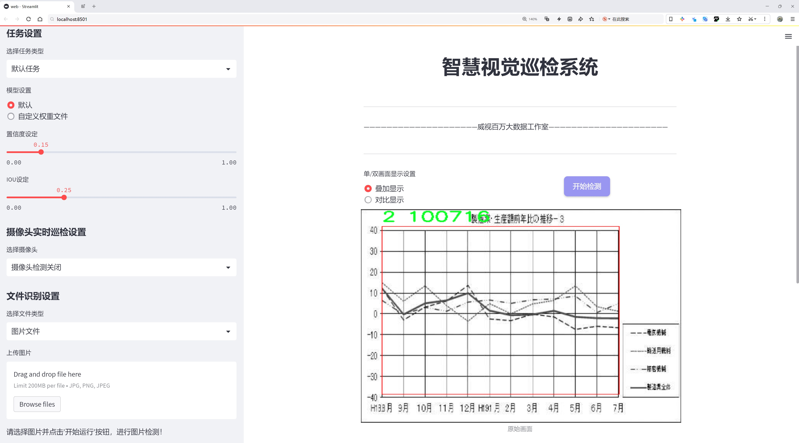

# 图表检测检测系统源码分享
 # [一条龙教学YOLOV8标注好的数据集一键训练_70+全套改进创新点发刊_Web前端展示]

### 1.研究背景与意义

项目参考[AAAI Association for the Advancement of Artificial Intelligence](https://gitee.com/qunmasj/projects)

项目来源[AACV Association for the Advancement of Computer Vision](https://github.com/qunshansj/good)

研究背景与意义

随着信息技术的迅猛发展，数据的可视化呈现成为了各个领域中不可或缺的一部分。图表作为信息传递的重要工具，广泛应用于科研、商业、教育等多个领域。图表的有效识别与分析不仅能够提升信息获取的效率，还能为决策提供有力支持。然而，传统的图表识别方法往往依赖于人工处理，效率低下且容易受到主观因素的影响。因此，开发一种高效、自动化的图表检测系统显得尤为重要。

近年来，深度学习技术的飞速发展为图像处理领域带来了革命性的变化，尤其是在目标检测方面。YOLO（You Only Look Once）系列模型以其高效的实时检测能力和较高的准确率，成为了目标检测领域的研究热点。YOLOv8作为该系列的最新版本，进一步优化了模型结构和算法，提升了检测精度和速度。然而，尽管YOLOv8在通用目标检测任务中表现出色，但在特定应用场景，如图表检测中，仍然面临着诸多挑战。图表的多样性、复杂性以及不同类型的图表所呈现的信息特征，使得现有的YOLOv8模型在图表检测任务中可能无法达到理想的效果。因此，基于YOLOv8的改进图表检测系统的研究具有重要的理论和实际意义。

本研究旨在通过改进YOLOv8模型，针对图表检测任务的特点，设计出一种高效的图表检测系统。我们使用的数据集包含3554张图像，涵盖了三类不同的图表类型，分别为类0、类1和类2。这一数据集的构建为模型的训练和评估提供了丰富的样本基础。通过对这些图表进行标注和分类，我们能够更好地训练模型，使其具备对不同类型图表的识别能力。此外，数据集的多样性和复杂性也为模型的泛化能力提供了良好的测试平台。

在研究过程中，我们将重点关注如何通过改进YOLOv8的网络结构、损失函数以及数据增强技术，提升模型在图表检测任务中的表现。通过引入新的特征提取模块和优化算法，我们期望能够提高模型对图表中各种元素的识别精度，包括图例、坐标轴、数据点等。同时，针对图表中可能存在的噪声和干扰，我们将探索更为鲁棒的检测策略，以确保模型在实际应用中的稳定性和可靠性。

本研究的意义不仅在于提升图表检测的技术水平，更在于推动数据可视化领域的智能化进程。通过实现高效的图表检测系统，我们能够为科研人员、商业分析师和教育工作者提供更为便捷的信息获取工具，进而促进数据驱动决策的实现。此外，研究成果还将为相关领域的后续研究提供理论基础和技术支持，推动目标检测技术在更多实际应用场景中的发展。综上所述，基于改进YOLOv8的图表检测系统的研究具有重要的学术价值和广泛的应用前景。

### 2.图片演示




##### 注意：由于此博客编辑较早，上面“2.图片演示”和“3.视频演示”展示的系统图片或者视频可能为老版本，新版本在老版本的基础上升级如下：（实际效果以升级的新版本为准）

  （1）适配了YOLOV8的“目标检测”模型和“实例分割”模型，通过加载相应的权重（.pt）文件即可自适应加载模型。

  （2）支持“图片识别”、“视频识别”、“摄像头实时识别”三种识别模式。

  （3）支持“图片识别”、“视频识别”、“摄像头实时识别”三种识别结果保存导出，解决手动导出（容易卡顿出现爆内存）存在的问题，识别完自动保存结果并导出到tempDir中。

  （4）支持Web前端系统中的标题、背景图等自定义修改，后面提供修改教程。

  另外本项目提供训练的数据集和训练教程,暂不提供权重文件（best.pt）,需要您按照教程进行训练后实现图片演示和Web前端界面演示的效果。

### 3.视频演示

[3.1 视频演示](https://www.bilibili.com/video/BV1jUsMezEKx/?vd_source=ff015de2d29cbe2a9cdbfa7064407a08)

### 4.数据集信息展示

数据集信息展示

在本研究中，我们使用了名为“aicheckaids”的数据集，以改进YOLOv8模型在图表检测任务中的表现。该数据集包含3554幅图像，涵盖了三个不同的类别，这些类别为模型的训练提供了丰富的样本，确保了模型在实际应用中的泛化能力。数据集的设计旨在支持对象检测任务，尤其是在图表和图形识别领域，具有重要的应用价值。

数据集中包含的三类对象，分别用数字0、1和2进行标识。这种分类方式不仅简洁明了，而且为模型的训练提供了清晰的目标。通过对这三类对象的学习，YOLOv8模型能够有效地识别和分类图表中的不同元素，从而提升其在图表检测中的准确性和效率。每个类别的样本数量分布均衡，使得模型在训练过程中能够充分学习到每个类别的特征，避免了因样本不均衡而导致的偏差。

该数据集的图像数量为3554幅，涵盖了多种不同的图表类型和样式。这些图像的多样性不仅提高了模型的鲁棒性，还使得模型能够适应不同的应用场景，例如科学报告、商业分析和学术研究等领域中常见的图表。数据集中的图像质量较高，清晰度和分辨率均能满足深度学习模型的需求，这为后续的训练和测试提供了良好的基础。

此外，数据集的许可类型为CC BY 4.0，这意味着用户在使用该数据集时可以自由地复制、分发和修改，只需适当归属原作者即可。这种开放的许可政策鼓励了学术界和工业界的广泛使用，促进了研究的透明性和合作性。通过使用该数据集，研究人员和开发者能够在改进YOLOv8模型的同时，分享他们的成果和经验，从而推动整个领域的发展。

在训练过程中，数据集的准备和预处理是至关重要的步骤。我们将图像进行标准化处理，以确保输入数据的一致性。同时，针对不同类别的图像，我们还进行了数据增强操作，例如旋转、缩放和裁剪等，以增加模型的训练样本多样性。这些操作不仅能够提升模型的性能，还能有效防止过拟合现象的发生。

综上所述，“aicheckaids”数据集为YOLOv8模型的训练提供了丰富的资源，涵盖了多样的图表类型和清晰的类别划分。通过合理利用该数据集，我们期望能够显著提升模型在图表检测任务中的准确性和效率，为相关领域的研究和应用提供更为强大的技术支持。随着数据集的不断扩展和模型的持续优化，我们相信在未来的研究中，图表检测技术将会迎来更大的突破和进展。


### 5.全套项目环境部署视频教程（零基础手把手教学）

[5.1 环境部署教程链接（零基础手把手教学）](https://www.ixigua.com/7404473917358506534?logTag=c807d0cbc21c0ef59de5)


[5.2 安装Python虚拟环境创建和依赖库安装视频教程链接（零基础手把手教学）](https://www.ixigua.com/7404474678003106304?logTag=1f1041108cd1f708b01a)

### 6.手把手YOLOV8训练视频教程（零基础小白有手就能学会）

[6.1 环境部署教程链接（零基础手把手教学）](https://www.ixigua.com/7404477157818401292?logTag=d31a2dfd1983c9668658)

### 7.70+种全套YOLOV8创新点代码加载调参视频教程（一键加载写好的改进模型的配置文件）

[7.1 环境部署教程链接（零基础手把手教学）](https://www.ixigua.com/7404478314661806627?logTag=29066f8288e3f4eea3a4)

### 8.70+种全套YOLOV8创新点原理讲解（非科班也可以轻松写刊发刊，V10版本正在科研待更新）

由于篇幅限制，每个创新点的具体原理讲解就不一一展开，具体见下列网址中的创新点对应子项目的技术原理博客网址【Blog】：


[8.1 70+种全套YOLOV8创新点原理讲解链接](https://gitee.com/qunmasj/good)

### 9.系统功能展示（检测对象为举例，实际内容以本项目数据集为准）

图9.1.系统支持检测结果表格显示

  图9.2.系统支持置信度和IOU阈值手动调节

  图9.3.系统支持自定义加载权重文件best.pt(需要你通过步骤5中训练获得)

  图9.4.系统支持摄像头实时识别

  图9.5.系统支持图片识别

  图9.6.系统支持视频识别

  图9.7.系统支持识别结果文件自动保存

  图9.8.系统支持Excel导出检测结果数据


### 10.原始YOLOV8算法原理

原始YOLOv8算法原理

YOLOv8作为目标检测领域的最新进展，延续了YOLO系列模型的高效性与精确性，同时在架构上进行了诸多创新与优化。其设计理念旨在通过简化网络结构与增强特征提取能力，以实现更快的推理速度和更高的检测精度。YOLOv8的整体架构可以分为输入层、主干网络（Backbone）、颈部网络（Neck）和头部网络（Head）四个主要组件，每个部分在整个目标检测过程中扮演着不可或缺的角色。

在输入层，YOLOv8首先对输入图像进行缩放，以满足模型所需的特定输入尺寸。这一过程不仅确保了输入数据的一致性，还为后续的特征提取奠定了基础。随后，主干网络通过一系列卷积操作对图像进行下采样，以提取出图像的深层特征。YOLOv8在主干网络中采用了批归一化和SiLUR激活函数，这种设计旨在加速训练过程并提高模型的非线性表达能力。通过这些卷积层，模型能够捕捉到图像中的重要信息，并为后续的特征处理提供丰富的特征图。

主干网络的核心在于C2f模块，该模块借鉴了YOLOv7中的E-ELAN结构，通过跨层分支连接来增强模型的梯度流动性。这种设计使得网络在进行特征提取时能够更好地保留信息，减少了信息的损失，从而改善了目标检测的结果。C2f模块的引入不仅提升了特征提取的效率，还使得模型在处理复杂场景时具备更强的鲁棒性。此外，主干网络末尾的SPPFl块通过三个最大池化层来处理多尺度特征，进一步增强了网络的特征抽象能力，使得模型能够更好地适应不同尺寸的目标。

颈部网络则是YOLOv8的另一个重要组成部分，其主要功能是融合来自主干网络不同阶段的特征图信息。YOLOv8采用了FPNS（Feature Pyramid Network）和PAN（Path Aggregation Network）结构，以实现多尺度特征的有效融合。这一过程不仅提高了目标检测的性能，还增强了模型对不同尺度目标的适应能力。通过对不同层次特征的综合利用，颈部网络能够为头部网络提供更加丰富和全面的特征信息，从而提升最终的检测效果。

在头部网络中，YOLOv8采用了解耦的检测头设计。与传统的单一检测头不同，YOLOv8通过两个并行的卷积分支分别计算回归和类别的损失。这种解耦设计的优势在于，它能够更有效地处理目标检测任务中的回归与分类问题，使得模型在面对复杂场景时能够更好地平衡这两者之间的关系。头部网络的结构设计使得YOLOv8在进行目标检测时，能够同时兼顾精度与速度，满足实时应用的需求。

值得一提的是，YOLOv8在模型设置上提供了多种选择，包括YOLOv8n、YOLOv8s、YOLOv8m、YOLOv8l和YOLOv8x等五种不同的网络结构。这些结构的主要区别在于Backbone的层数和残差块的数量，用户可以根据具体的应用场景和硬件条件选择合适的模型。通过调整depth_factor、width_factor和ratio等参数，用户可以灵活地控制模型的深度和宽度，从而在性能与资源消耗之间找到最佳平衡。

总的来说，YOLOv8算法在目标检测领域的成功，得益于其精心设计的网络结构和高效的特征处理机制。通过主干网络的特征提取、颈部网络的特征融合以及头部网络的解耦检测，YOLOv8实现了在多种复杂场景下的高效目标检测。其在速度与精度上的双重优势，使得YOLOv8成为了当前业界最流行和成功的目标检测模型之一。随着技术的不断进步，YOLOv8无疑将在未来的应用中展现出更大的潜力和价值。


### 11.项目核心源码讲解（再也不用担心看不懂代码逻辑）

#### 11.1 ultralytics\utils\callbacks\wb.py

以下是经过简化和注释的核心代码部分，保留了最重要的功能，并添加了详细的中文注释：

```python
# 导入必要的库
from ultralytics.utils import SETTINGS, TESTS_RUNNING
from ultralytics.utils.torch_utils import model_info_for_loggers
import numpy as np
import pandas as pd

# 尝试导入wandb库并进行基本的检查
try:
    assert not TESTS_RUNNING  # 确保不是在测试中
    assert SETTINGS["wandb"] is True  # 确保wandb集成已启用
    import wandb as wb
    assert hasattr(wb, "__version__")  # 确保wandb是一个有效的包
except (ImportError, AssertionError):
    wb = None  # 如果导入失败，则将wb设置为None

# 自定义表格函数，用于创建和记录精确度-召回曲线
def _custom_table(x, y, classes, title="Precision Recall Curve", x_title="Recall", y_title="Precision"):
    """
    创建并记录自定义的精确度-召回曲线可视化。

    参数:
        x (List): x轴的值，长度为N。
        y (List): y轴的值，长度为N。
        classes (List): 每个点的类别标签，长度为N。
        title (str): 图表标题，默认为'Precision Recall Curve'。
        x_title (str): x轴标签，默认为'Recall'。
        y_title (str): y轴标签，默认为'Precision'。

    返回:
        (wandb.Object): 适合记录的wandb对象，展示自定义的度量可视化。
    """
    df = pd.DataFrame({"class": classes, "y": y, "x": x}).round(3)  # 创建数据框
    fields = {"x": "x", "y": "y", "class": "class"}
    string_fields = {"title": title, "x-axis-title": x_title, "y-axis-title": y_title}
    return wb.plot_table(
        "wandb/area-under-curve/v0", wb.Table(dataframe=df), fields=fields, string_fields=string_fields
    )

# 绘制曲线的函数
def _plot_curve(x, y, names=None, id="precision-recall", title="Precision Recall Curve", x_title="Recall", y_title="Precision", num_x=100, only_mean=False):
    """
    记录度量曲线可视化。

    参数:
        x (np.ndarray): x轴的数据点，长度为N。
        y (np.ndarray): y轴的数据点，形状为CxN，C为类别数。
        names (list): 类别名称，长度为C。
        id (str): 在wandb中记录数据的唯一标识符。
        title (str): 可视化图表的标题。
        x_title (str): x轴的标签。
        y_title (str): y轴的标签。
        num_x (int): 可视化的插值数据点数量。
        only_mean (bool): 是否仅绘制均值曲线的标志。

    注意:
        该函数利用'_custom_table'函数生成实际的可视化。
    """
    if names is None:
        names = []  # 如果没有提供类别名称，则初始化为空列表
    x_new = np.linspace(x[0], x[-1], num_x).round(5)  # 创建新的x值

    # 创建用于记录的数组
    x_log = x_new.tolist()
    y_log = np.interp(x_new, x, np.mean(y, axis=0)).round(3).tolist()  # 插值计算y值

    if only_mean:
        # 仅记录均值曲线
        table = wb.Table(data=list(zip(x_log, y_log)), columns=[x_title, y_title])
        wb.run.log({title: wb.plot.line(table, x_title, y_title, title=title)})
    else:
        # 记录每个类别的曲线
        classes = ["mean"] * len(x_log)
        for i, yi in enumerate(y):
            x_log.extend(x_new)  # 添加新的x值
            y_log.extend(np.interp(x_new, x, yi))  # 对y进行插值
            classes.extend([names[i]] * len(x_new))  # 添加类别名称
        wb.log({id: _custom_table(x_log, y_log, classes, title, x_title, y_title)}, commit=False)

# 训练开始时的回调函数
def on_pretrain_routine_start(trainer):
    """初始化并启动项目。"""
    wb.run or wb.init(project=trainer.args.project or "YOLOv8", name=trainer.args.name, config=vars(trainer.args))

# 训练周期结束时的回调函数
def on_fit_epoch_end(trainer):
    """在每个周期结束时记录训练指标和模型信息。"""
    wb.run.log(trainer.metrics, step=trainer.epoch + 1)  # 记录指标
    # 记录图表
    _log_plots(trainer.plots, step=trainer.epoch + 1)
    _log_plots(trainer.validator.plots, step=trainer.epoch + 1)
    if trainer.epoch == 0:
        wb.run.log(model_info_for_loggers(trainer), step=trainer.epoch + 1)  # 记录模型信息

# 训练结束时的回调函数
def on_train_end(trainer):
    """在训练结束时保存最佳模型。"""
    _log_plots(trainer.validator.plots, step=trainer.epoch + 1)
    _log_plots(trainer.plots, step=trainer.epoch + 1)
    art = wb.Artifact(type="model", name=f"run_{wb.run.id}_model")  # 创建模型工件
    if trainer.best.exists():
        art.add_file(trainer.best)  # 添加最佳模型文件
        wb.run.log_artifact(art, aliases=["best"])  # 记录工件
    wb.run.finish()  # 结束wandb运行

# 回调函数字典
callbacks = {
    "on_pretrain_routine_start": on_pretrain_routine_start,
    "on_fit_epoch_end": on_fit_epoch_end,
    "on_train_end": on_train_end,
} if wb else {}
```

### 主要功能概述：
1. **自定义表格和曲线绘制**：通过`_custom_table`和`_plot_curve`函数，能够创建和记录精确度-召回曲线的可视化，支持对不同类别的监控。
2. **训练过程中的回调**：在训练的不同阶段（如开始、每个周期结束、训练结束）记录相关的指标和模型信息。
3. **与WandB集成**：利用WandB进行实验的可视化和记录，便于后续分析和调试。

这个文件是Ultralytics YOLO项目中的一个回调模块，主要用于与Weights & Biases（wandb）进行集成，以便在训练过程中记录和可视化模型的性能指标。首先，文件导入了一些必要的库和模块，包括wandb、numpy和pandas，并在导入时进行了必要的检查，以确保wandb库可用且集成设置已启用。

文件中定义了几个主要的函数。首先是`_custom_table`函数，它用于创建和记录一个自定义的精确度-召回曲线的可视化。该函数接收x轴和y轴的数据点、类别标签以及图表的标题和轴标签等参数，生成一个pandas DataFrame，并使用wandb的`plot_table`功能将其记录为一个可视化对象。

接下来是`_plot_curve`函数，它用于生成并记录一个度量曲线的可视化。该函数根据输入的数据点生成曲线，可以选择记录所有类别的曲线或仅记录平均曲线。它通过插值生成新的x轴数据点，并将结果记录到wandb中。

`_log_plots`函数则负责记录输入字典中的图表，如果这些图表在指定的步骤中尚未记录。它会检查每个图表的时间戳，以避免重复记录。

接下来的几个函数分别在训练的不同阶段被调用。`on_pretrain_routine_start`函数在预训练开始时初始化wandb项目。`on_fit_epoch_end`函数在每个训练周期结束时记录训练指标和模型信息。`on_train_epoch_end`函数在每个训练周期结束时记录标签损失和学习率，并在第一次周期结束时记录图表。`on_train_end`函数在训练结束时保存最佳模型，并记录验证器的图表和曲线。

最后，文件定义了一个回调字典，包含了在训练过程中需要调用的函数，如果wandb可用，则包含这些回调函数，否则为空。这些回调函数的作用是确保在训练的不同阶段，能够记录相关的性能指标和可视化结果，以便后续分析和优化模型。

#### 11.2 ui.py

```python
import sys
import subprocess

def run_script(script_path):
    """
    使用当前 Python 环境运行指定的脚本。

    Args:
        script_path (str): 要运行的脚本路径

    Returns:
        None
    """
    # 获取当前 Python 解释器的路径
    python_path = sys.executable

    # 构建运行命令，使用 streamlit 运行指定的脚本
    command = f'"{python_path}" -m streamlit run "{script_path}"'

    # 执行命令
    result = subprocess.run(command, shell=True)
    # 检查命令执行结果，如果返回码不为0，则表示出错
    if result.returncode != 0:
        print("脚本运行出错。")


# 实例化并运行应用
if __name__ == "__main__":
    # 指定要运行的脚本路径
    script_path = "web.py"  # 这里可以替换为实际的脚本路径

    # 调用函数运行脚本
    run_script(script_path)
```

### 代码核心部分及注释说明：

1. **导入模块**：
   - `import sys`: 导入系统相关的模块，用于获取当前 Python 解释器的路径。
   - `import subprocess`: 导入子进程模块，用于在 Python 中执行外部命令。

2. **定义 `run_script` 函数**：
   - 该函数接收一个参数 `script_path`，表示要运行的 Python 脚本的路径。
   - 使用 `sys.executable` 获取当前 Python 解释器的路径，以确保在正确的环境中运行脚本。
   - 构建一个命令字符串，使用 `streamlit` 模块运行指定的脚本。
   - 使用 `subprocess.run` 执行构建的命令，并通过 `shell=True` 允许在 shell 中执行命令。
   - 检查命令的返回码，如果不为0，表示执行出错，打印错误信息。

3. **主程序入口**：
   - `if __name__ == "__main__":` 确保只有在直接运行该脚本时才会执行以下代码。
   - 指定要运行的脚本路径（在这里是 `web.py`）。
   - 调用 `run_script` 函数，传入脚本路径以执行该脚本。

这个程序文件名为 `ui.py`，其主要功能是使用当前的 Python 环境来运行一个指定的脚本，具体是一个名为 `web.py` 的 Streamlit 应用。

首先，程序导入了几个必要的模块，包括 `sys`、`os` 和 `subprocess`。其中，`sys` 模块用于访问与 Python 解释器相关的变量和函数，`os` 模块提供了与操作系统交互的功能，而 `subprocess` 模块则用于执行外部命令。

接下来，程序从 `QtFusion.path` 模块中导入了 `abs_path` 函数，这个函数的作用是获取给定路径的绝对路径。

在 `run_script` 函数中，程序接受一个参数 `script_path`，表示要运行的脚本的路径。函数首先获取当前 Python 解释器的路径，并将其存储在 `python_path` 变量中。然后，程序构建了一个命令字符串，该命令用于运行指定的脚本，具体是通过 `streamlit run` 命令来启动 Streamlit 应用。

接着，程序使用 `subprocess.run` 方法执行构建好的命令。如果命令执行后返回的状态码不为零，表示脚本运行出错，程序会打印出错误信息。

在文件的最后部分，程序通过 `if __name__ == "__main__":` 语句来判断当前模块是否是主程序。如果是，程序会调用 `abs_path` 函数获取 `web.py` 的绝对路径，并将其传递给 `run_script` 函数以执行该脚本。

总体来说，这个程序的主要目的是方便地启动一个 Streamlit 应用，通过调用外部命令来运行指定的 Python 脚本。

#### 11.3 ultralytics\models\yolo\pose\__init__.py

以下是代码中最核心的部分，并附上详细的中文注释：

```python
# 导入所需的模块
from .predict import PosePredictor  # 导入姿态预测器类
from .train import PoseTrainer      # 导入姿态训练器类
from .val import PoseValidator       # 导入姿态验证器类

# 定义模块的公开接口
__all__ = "PoseTrainer", "PoseValidator", "PosePredictor"  # 指定在使用 'from module import *' 时，允许导入的类
```

### 详细注释：
1. **模块导入**：
   - `from .predict import PosePredictor`：从当前包的 `predict` 模块中导入 `PosePredictor` 类，该类负责姿态预测的功能。
   - `from .train import PoseTrainer`：从当前包的 `train` 模块中导入 `PoseTrainer` 类，该类用于训练姿态模型。
   - `from .val import PoseValidator`：从当前包的 `val` 模块中导入 `PoseValidator` 类，该类用于验证姿态模型的性能。

2. **公开接口定义**：
   - `__all__` 是一个特殊变量，用于定义当使用 `from module import *` 时，哪些名称是可以被导入的。在这里，`PoseTrainer`、`PoseValidator` 和 `PosePredictor` 被列为可公开的接口，意味着这些类是该模块的主要功能部分。

这个程序文件是Ultralytics YOLO项目中的一个模块，专门用于姿态估计（Pose Estimation）。文件的开头有一个注释，说明了该项目使用的是AGPL-3.0许可证，表示该代码是开源的，并且可以自由使用和修改，但需要遵循相应的许可证条款。

接下来，文件通过相对导入的方式引入了三个类：`PosePredictor`、`PoseTrainer`和`PoseValidator`。这些类分别负责姿态估计的不同功能。`PosePredictor`用于进行姿态预测，`PoseTrainer`用于训练模型，而`PoseValidator`则用于验证模型的性能。

最后，`__all__`变量定义了该模块的公共接口，列出了可以被外部导入的类名。这意味着当其他模块使用`from ultralytics.models.yolo.pose import *`的方式导入时，只会导入`PoseTrainer`、`PoseValidator`和`PosePredictor`这三个类，确保了模块的封装性和可维护性。通过这种方式，用户可以方便地使用这些功能，而不需要了解模块内部的实现细节。

#### 11.4 ultralytics\engine\model.py

以下是经过简化并添加详细中文注释的核心代码部分：

```python
import inspect
import sys
from pathlib import Path
from typing import Union
from ultralytics.nn import nn  # 导入PyTorch的nn模块

class Model(nn.Module):
    """
    YOLO模型的基础类，统一所有模型的API接口。
    """

    def __init__(self, model: Union[str, Path] = "yolov8n.pt", task=None, verbose=False) -> None:
        """
        初始化YOLO模型。

        Args:
            model (Union[str, Path], optional): 要加载或创建的模型路径或名称，默认为'yolov8n.pt'。
            task (Any, optional): YOLO模型的任务类型，默认为None。
            verbose (bool, optional): 是否启用详细模式。
        """
        super().__init__()
        self.model = None  # 模型对象
        self.task = task  # 任务类型
        self.model_name = str(model).strip()  # 去除模型名称的空格

        # 检查是否为Ultralytics HUB模型
        if self.is_hub_model(model):
            self.session = self._get_hub_session(model)  # 获取HUB会话
            model = self.session.model_file  # 获取模型文件

        # 加载或创建新的YOLO模型
        model = self.check_model_file(model)  # 检查模型文件
        if Path(model).suffix in (".yaml", ".yml"):
            self._new(model, task=task, verbose=verbose)  # 从配置文件创建新模型
        else:
            self._load(model, task=task)  # 从权重文件加载模型

        self.model_name = model  # 更新模型名称

    def predict(self, source=None, stream=False, **kwargs):
        """
        使用YOLO模型进行预测。

        Args:
            source (str | int | PIL | np.ndarray): 要进行预测的图像源，接受YOLO模型支持的所有源类型。
            stream (bool): 是否流式传输预测结果，默认为False。
            **kwargs : 传递给预测器的其他关键字参数。

        Returns:
            (List[ultralytics.engine.results.Results]): 预测结果列表。
        """
        if source is None:
            source = "assets"  # 默认源为"assets"
            print(f"警告: 'source'缺失，使用默认'source={source}'。")

        # 设置预测器
        if not self.predictor:
            self.predictor = self._smart_load("predictor")(overrides=kwargs)  # 加载预测器
            self.predictor.setup_model(model=self.model)  # 设置模型
        return self.predictor(source=source, stream=stream)  # 返回预测结果

    @staticmethod
    def is_hub_model(model):
        """检查提供的模型是否为HUB模型。"""
        return model.startswith("https://hub.ultralytics.com/models/")  # 检查模型URL

    def _new(self, cfg: str, task=None, model=None, verbose=False):
        """
        初始化新模型并推断任务类型。

        Args:
            cfg (str): 模型配置文件
            task (str | None): 模型任务
            model (BaseModel): 自定义模型。
            verbose (bool): 加载时显示模型信息
        """
        cfg_dict = self.load_yaml(cfg)  # 加载YAML配置
        self.task = task or self.guess_model_task(cfg_dict)  # 推断任务类型
        self.model = (model or self._smart_load("model"))(cfg_dict, verbose=verbose)  # 创建模型

    def _load(self, weights: str, task=None):
        """
        从权重文件加载模型并推断任务类型。

        Args:
            weights (str): 要加载的模型权重
            task (str | None): 模型任务
        """
        self.model, _ = self.attempt_load_one_weight(weights)  # 加载权重
        self.task = self.model.args["task"]  # 获取任务类型

    def _smart_load(self, key):
        """加载模型/训练器/验证器/预测器。"""
        try:
            return self.task_map[self.task][key]  # 根据任务类型加载相应的组件
        except Exception as e:
            raise NotImplementedError(f"模型不支持该任务类型：{self.task}") from e

    @property
    def task_map(self):
        """返回任务到模型、训练器、验证器和预测器类的映射。"""
        raise NotImplementedError("请提供任务映射！")
```

### 代码注释说明
1. **Model类**: 这是YOLO模型的基础类，封装了模型的加载、预测、训练等功能。
2. **__init__方法**: 初始化模型，检查模型类型并加载相应的模型文件。
3. **predict方法**: 进行预测，接受不同类型的输入源，并返回预测结果。
4. **is_hub_model方法**: 检查模型是否来自Ultralytics HUB。
5. **_new和_load方法**: 分别用于创建新模型和从权重文件加载模型。
6. **_smart_load方法**: 根据任务类型动态加载相应的组件。
7. **task_map属性**: 提供任务与模型组件之间的映射，需由子类实现。

这个程序文件定义了一个名为 `Model` 的类，主要用于实现和管理 YOLO（You Only Look Once）目标检测模型。该类继承自 PyTorch 的 `nn.Module`，并提供了一系列方法和属性，以便于模型的加载、训练、预测和评估。

在类的构造函数 `__init__` 中，用户可以指定模型文件的路径、任务类型和是否启用详细模式。构造函数首先检查模型是否来自 Ultralytics HUB 或 Triton Server，如果是，则相应地处理。接着，它会根据提供的模型文件名加载模型或创建新模型。

类中有多个方法，例如 `__call__` 方法使得可以通过调用类的实例来进行预测，实际上是调用了 `predict` 方法。`_new` 和 `_load` 方法分别用于初始化新模型和加载已有模型的权重。`_check_is_pytorch_model` 方法用于检查当前模型是否为 PyTorch 模型，并在不是时抛出错误。

模型的预测功能通过 `predict` 方法实现，用户可以传入图像源、流式处理选项以及其他参数。`track` 方法用于在输入源上执行对象跟踪，`val` 方法用于在给定数据集上验证模型的性能。`train` 方法则用于训练模型，支持从指定的配置文件中读取训练参数。

此外，类还提供了模型信息的日志记录、模型参数的重置、模型的导出、超参数调优等功能。通过 `add_callback`、`clear_callback` 和 `reset_callbacks` 方法，用户可以管理模型的回调函数。

该类还定义了一些静态方法，例如 `is_hub_model` 和 `is_triton_model`，用于检查模型的来源。`task_map` 属性则是一个未实现的映射，用户需要根据具体任务提供相应的实现。

总的来说，这个 `Model` 类是一个功能强大的接口，封装了 YOLO 模型的各项操作，旨在简化用户在使用目标检测模型时的工作流程。

#### 11.5 ultralytics\utils\callbacks\__init__.py

```python
# Ultralytics YOLO 🚀, AGPL-3.0 license

# 从当前包的 base 模块导入三个函数：
# 1. add_integration_callbacks: 添加集成回调函数
# 2. default_callbacks: 默认回调函数
# 3. get_default_callbacks: 获取默认回调函数
from .base import add_integration_callbacks, default_callbacks, get_default_callbacks

# 定义模块的公开接口，指定可以被外部访问的函数
__all__ = "add_integration_callbacks", "default_callbacks", "get_default_callbacks"
```

### 代码核心部分及注释说明：
1. **导入模块**：从当前包的 `base` 模块中导入了三个重要的函数，这些函数可能用于处理回调逻辑。
2. **公开接口**：通过 `__all__` 变量定义了模块的公开接口，确保外部代码只能访问这些指定的函数，增强了模块的封装性。

这个程序文件是Ultralytics YOLO项目中的一个模块，主要用于回调函数的管理和集成。文件的开头有一个注释，表明这是Ultralytics YOLO项目的一部分，并且遵循AGPL-3.0许可证。

在代码中，首先从同一目录下的`base`模块导入了三个函数：`add_integration_callbacks`、`default_callbacks`和`get_default_callbacks`。这些函数的具体功能可能与回调的添加、默认回调的定义以及获取默认回调有关，尽管在这个文件中并没有详细说明它们的实现。

最后，`__all__`变量被定义为一个元组，包含了这三个函数的名称。这意味着当使用`from ultralytics.utils.callbacks import *`这样的语句时，只有这三个函数会被导入。这是一种控制模块导出内容的方式，确保用户只访问到模块中希望公开的部分。

总的来说，这个文件的主要作用是作为回调函数的接口，方便其他模块进行回调的集成和管理。

#### 11.6 train.py

以下是代码中最核心的部分，并附上详细的中文注释：

```python
import os
import torch
import yaml
from ultralytics import YOLO  # 导入YOLO模型
from QtFusion.path import abs_path  # 导入获取绝对路径的函数

# 确定使用的设备，如果有可用的GPU则使用GPU，否则使用CPU
device = "0" if torch.cuda.is_available() else "cpu"

if __name__ == '__main__':  # 确保该模块被直接运行时才执行以下代码
    workers = 1  # 设置数据加载的工作进程数量
    batch = 2  # 设置每个批次的大小

    data_name = "data"  # 数据集名称
    # 获取数据集的yaml配置文件的绝对路径
    data_path = abs_path(f'datasets/{data_name}/{data_name}.yaml', path_type='current')  
    unix_style_path = data_path.replace(os.sep, '/')  # 将路径转换为Unix风格

    # 获取目录路径
    directory_path = os.path.dirname(unix_style_path)
    
    # 读取YAML文件，保持原有顺序
    with open(data_path, 'r') as file:
        data = yaml.load(file, Loader=yaml.FullLoader)
    
    # 修改YAML文件中的path项为数据集的目录路径
    if 'path' in data:
        data['path'] = directory_path
        # 将修改后的数据写回YAML文件
        with open(data_path, 'w') as file:
            yaml.safe_dump(data, file, sort_keys=False)

    # 加载预训练的YOLOv8模型
    model = YOLO(model='./ultralytics/cfg/models/v8/yolov8s.yaml', task='detect')  
    
    # 开始训练模型
    results2 = model.train(  
        data=data_path,  # 指定训练数据的配置文件路径
        device=device,  # 使用指定的设备进行训练
        workers=workers,  # 指定使用的工作进程数量
        imgsz=640,  # 指定输入图像的大小为640x640
        epochs=100,  # 指定训练100个epoch
        batch=batch,  # 指定每个批次的大小
        name='train_v8_' + data_name  # 指定训练任务的名称
    )
```

### 代码注释说明：
1. **导入必要的库**：导入了操作系统、PyTorch、YAML处理、YOLO模型以及路径处理的库。
2. **设备选择**：根据是否有可用的GPU来选择训练设备。
3. **数据集配置**：设置数据集名称，并获取相应的YAML配置文件的绝对路径。
4. **读取和修改YAML文件**：读取YAML文件内容，修改其中的`path`项为数据集的目录路径，并将修改后的内容写回文件。
5. **模型加载**：加载YOLOv8的预训练模型。
6. **模型训练**：调用模型的训练方法，传入训练数据路径、设备、工作进程数量、图像大小、训练轮数、批次大小和训练任务名称等参数。

这个程序文件 `train.py` 是用于训练 YOLOv8 模型的脚本。首先，程序导入了必要的库，包括 `os`、`torch`、`yaml` 和 `ultralytics` 中的 YOLO 模型。接着，程序通过检查 CUDA 是否可用来确定使用 GPU 还是 CPU 进行训练。

在 `if __name__ == '__main__':` 语句下，程序确保只有在直接运行该脚本时才会执行以下代码。它设置了工作进程数量为 1，批次大小为 2，并定义了数据集的名称为 "data"。然后，程序构建了数据集 YAML 文件的绝对路径，并将路径格式转换为 Unix 风格。

接下来，程序获取了目录路径，并打开指定的 YAML 文件以读取数据。读取后，如果 YAML 文件中包含 `path` 项，程序会将其修改为当前目录路径，并将修改后的数据写回 YAML 文件，以确保数据路径的正确性。

随后，程序加载了预训练的 YOLOv8 模型，指定了模型的配置文件。然后，调用 `model.train()` 方法开始训练模型。在训练过程中，程序指定了训练数据的配置文件路径、使用的设备、工作进程数量、输入图像的大小（640x640）、训练的 epoch 数量（100）以及每个批次的大小（2）。最后，训练任务的名称被设置为 `'train_v8_' + data_name`，以便于后续的识别和管理。

总体来说，这个脚本提供了一个完整的流程，从数据集的准备到模型的训练，适合用于 YOLOv8 的目标检测任务。

### 12.系统整体结构（节选）

### 整体功能和构架概括

Ultralytics YOLO项目是一个用于目标检测和姿态估计的深度学习框架，主要基于YOLO（You Only Look Once）模型。该项目的整体功能包括模型的训练、验证、预测和回调管理。项目结构清晰，模块化设计使得各个功能之间的耦合度较低，便于维护和扩展。

- **模型训练**：通过 `train.py` 脚本进行模型的训练，支持自定义数据集和训练参数。
- **模型定义**：在 `model.py` 中定义了YOLO模型的结构和相关操作，封装了训练、预测和验证的功能。
- **回调管理**：通过 `callbacks` 模块管理训练过程中的回调函数，支持与外部工具（如Weights & Biases）集成。
- **姿态估计**：在 `pose/__init__.py` 中定义了与姿态估计相关的功能，支持姿态预测和训练。
- **工具函数**：提供了一系列工具函数，帮助处理数据、模型检查和其他辅助功能。

### 文件功能整理表

| 文件路径                                          | 功能描述                                               |
|--------------------------------------------------|--------------------------------------------------------|
| `ultralytics/utils/callbacks/wb.py`             | 集成Weights & Biases，记录训练过程中的性能指标和可视化结果。 |
| `ui.py`                                          | 启动Streamlit应用，运行指定的web.py脚本。               |
| `ultralytics/models/yolo/pose/__init__.py`      | 定义姿态估计相关的类（如PosePredictor、PoseTrainer、PoseValidator）。 |
| `ultralytics/engine/model.py`                   | 定义YOLO模型类，封装模型的加载、训练、预测和验证功能。  |
| `ultralytics/utils/callbacks/__init__.py`      | 管理回调函数的接口，方便其他模块进行回调的集成和管理。   |
| `train.py`                                       | 训练YOLOv8模型的主脚本，处理数据集和训练参数的设置。    |
| `ultralytics/models/sam/modules/transformer.py` | 定义与Transformer相关的模块，可能用于特征提取或增强。    |
| `ultralytics/trackers/utils/matching.py`        | 提供匹配算法，可能用于目标跟踪中的数据关联。             |
| `ultralytics/utils/checks.py`                   | 提供模型和数据的检查功能，确保训练过程中的有效性。       |
| `ultralytics/nn/modules/block.py`               | 定义神经网络模块的基本构建块，可能包括卷积层、激活函数等。 |

这个表格总结了每个文件的主要功能，展示了Ultralytics YOLO项目的模块化设计和各个组件之间的协作关系。

注意：由于此博客编辑较早，上面“11.项目核心源码讲解（再也不用担心看不懂代码逻辑）”中部分代码可能会优化升级，仅供参考学习，完整“训练源码”、“Web前端界面”和“70+种创新点源码”以“13.完整训练+Web前端界面+70+种创新点源码、数据集获取”的内容为准。

### 13.完整训练+Web前端界面+70+种创新点源码、数据集获取


https://mbd.pub/o/bread/ZpqWlZ1p